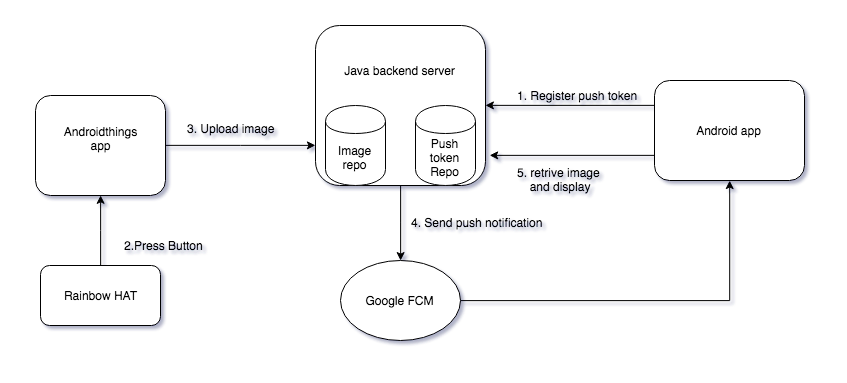

# android-camera-things

An android and androidthings app which uses a java server to send an image from things app to an android app via fcm push notification.

- Pre requisites
  - [Androidthings starter kit](https://androidthings.withgoogle.com/#!/kits/starter-kit)
  - [Enable FCM](https://firebase.google.com/docs/cloud-messaging/android/first-message)
  - Copy google-services.json file to root folder. 
  - Locally setup and run [FCM server](https://github.com/MoizAli/fcmserver)
 

### Android app
- Run the project, make sure FCM token is received and sent to your server.

### Androidthings app
- Run the things app and press Button A on RainbowHAT. It will take a picture from the available camera and upload the picture to your server. 
 
Enjoy :)
